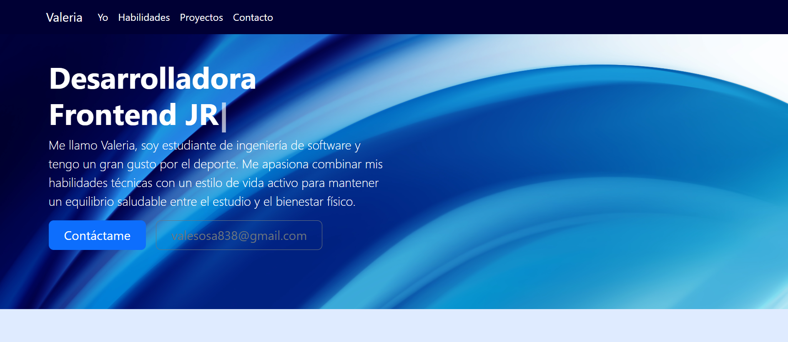
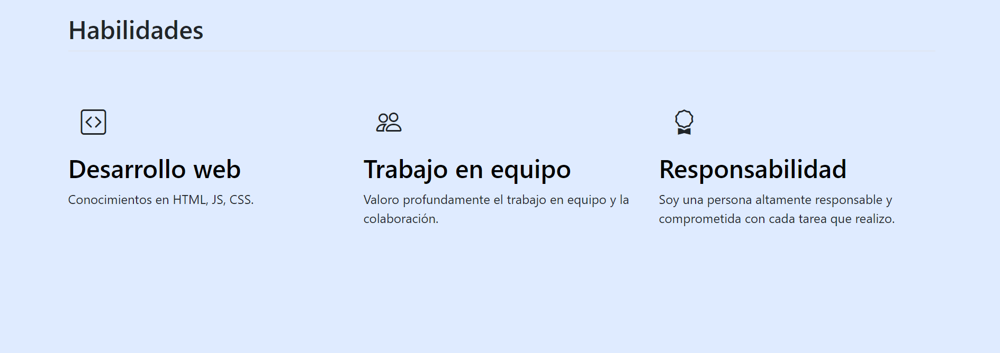
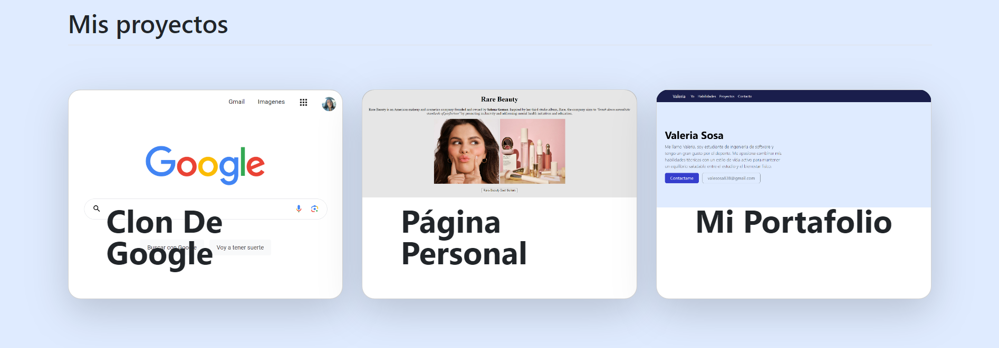
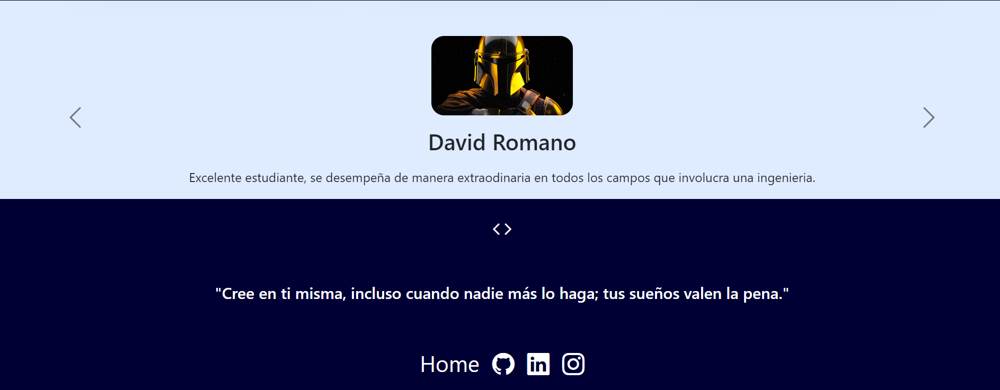

# Mi portafolio de habilidades TECNOLOCHICAS PRO

El presente proyecto es un portafolio desarrollado para poner en practica la habilidades obtenidas dentro del bootcamp de desarrollo frontend de Tecnolochicas PRO.

Fue desarrollado con HTML, JS, CSS y con el uso del framework de UI,Bootstrap utilizando ademas etiquetas externas. 

La pagina es responsiva (adaptable a difs tamanos de pantalla ) e incluye la presentacion de la autora de proyecto.

Proyecto desplegado: https://valjrz.netlify.app/

## Secciones de mi sitio

## Tecnologias 

* HTML
* CSS
* Bootstrap 
* Javascript
---
Desarrollado con 💗 por Valeria

